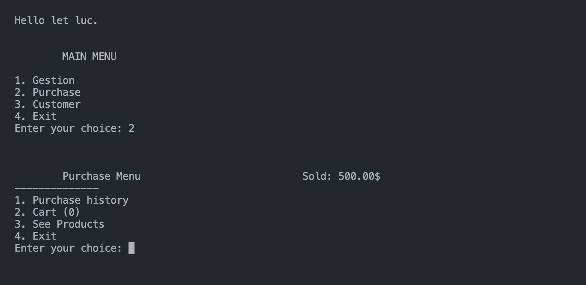

# CY-Shop 


This is our end-of-semester IT project as part of our pre-Eng1 MIM course at CY Tech.

## Summary
- [Content](#Content) Explain what the project is.
- [Preview](#Preview) Pictures of the program while runing.
- [Instructions](#Instructions) All informations that you need to compile and run the program.
- [Bugs](#Bugs) A list of known bugs.

## Content

The goal is to create a C program to manage stocks and customer files for a car spare parts store.

The program allows you to choose between three modes. The gestion mode, the purchase mode or the customer mode.

### Gestion Mode
The gestion mode allows you to display and increase current stocks within the limits of available space *(100 places)*.

### Purchase Mode
The purchase mode allows you to make purchases using your customer account. It can also allow you to search fo products in stock using their name or reference number.

### Customer Mode
The customer mode only allows you to delete your customer account from the database.

## Preview





## Instructions

1. Open a terminal window 
2. Clone the git repository to a location of your choice   
```sh
   git clone https://github.com/MI6-Pikes00/Projet-preing1
   ```

### Compile and Run
3. Enter the new folder
   ```sh
   cd Projet-preing1
   ```
4. Compile and run the project with *make* :
   ```sh
   make && ./CY-Shop
   ```


## Known Bugs

- Problem with *Add Product*: When you add a product to the stock, the scanf don't like when you put words with space. So, with a space it doesn't work. 
- Problem with *Search by Reference*: The search by Name work but the search by reference doesn't work correctly.
- Problem whem approuved cart, the program crash so purchase history is not completed
